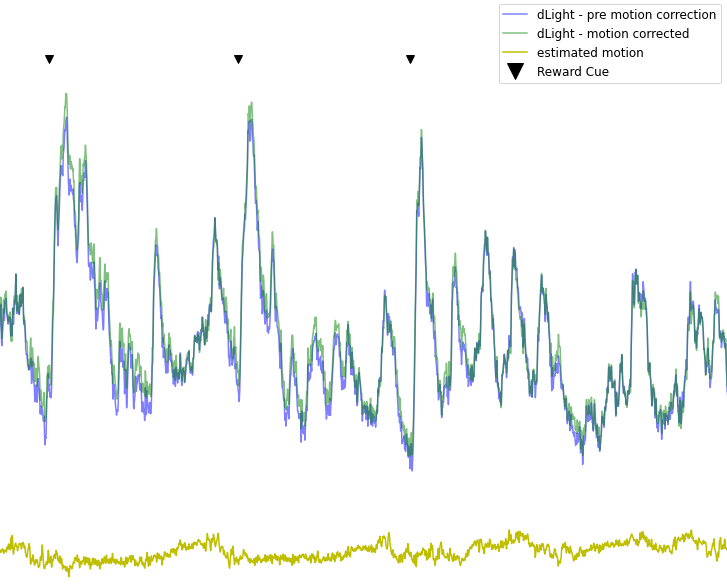

# Photometry pre-processing

This repository contains a Python notebook [Photometry data preprocessing.ipynb](https://github.com/ThomasAkam/photometry_preprocessing/blob/master/Photometry%20data%20preprocessing.ipynb) which demonstrates methods for pre-processing neuroscience fiber photometry data, including denoising, photobleaching and motion correction, and normalisation.

