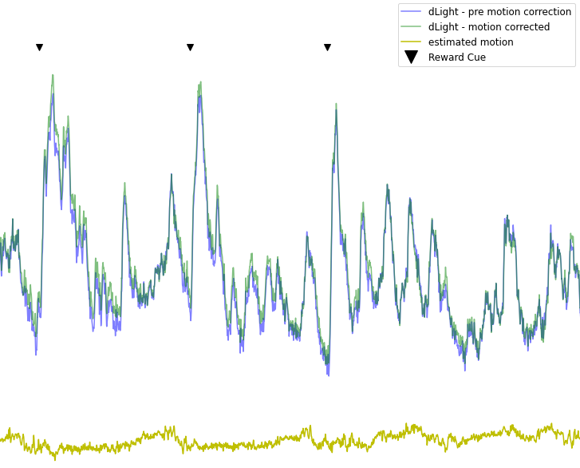

# Photometry pre-processing

This repository contains a Python notebook [Photometry data preprocessing.ipynb](https://github.com/ThomasAkam/photometry_preprocessing/blob/master/Photometry%20data%20preprocessing.ipynb) which demonstrates methods for pre-processing neuroscience fiber photometry data, including denoising, photobleaching and motion correction, and normalisation.

For more information of photometry data acquisition, pre-processing, and analysis see our [Neuron Primer](https://www.cell.com/neuron/fulltext/S0896-6273(23)00890-5) article.

See also our github repositories covering [data organisation](https://github.com/cognitive-circuits/data_organisation/) and [analysis](https://github.com/cognitive-circuits/photometry_analysis) for fiber photometry experiments in decision making tasks with a discrete trial structure.

